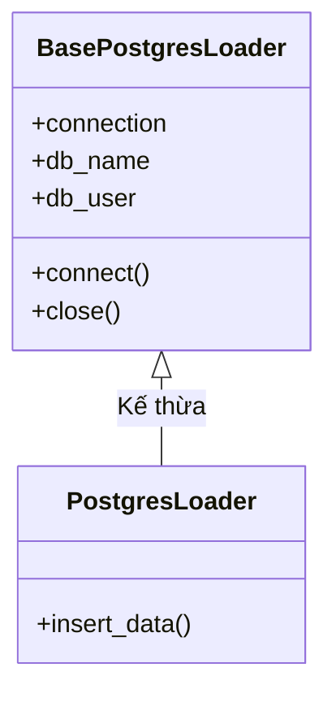

# loaders/ — Lớp Tải Dữ Liệu (Load Layer)

## Nhiệm vụ
Chịu trách nhiệm **duy nhất**: tiếp nhận dữ liệu từ API raw JSON và ghi an toàn vào PostgreSQL (Bronze Layer). Lớp này hoàn toàn tuân thủ lập trình hướng đối tượng (OOP) và cơ chế DRY (Don't Repeat Yourself).

---

## File: `base_loader.py` — `class BasePostgresLoader` (Lớp Cơ Sở)

Lớp cha cung cấp các hành vi dùng chung cho tất cả các Loader kết nối với PostgreSQL database.

### Khởi tạo (`__init__()`)
* **Fail-fast Validation:** Đọc và kiểm tra lập tức 5 biến môi trường cơ sở dữ liệu (`POSTGRES_DB`, `POSTGRES_USER`, `POSTGRES_PASSWORD`, `POSTGRES_HOST`, `POSTGRES_PORT`). Nếu thiếu bất kỳ biến nào, quăng lỗi `EnvironmentError` ngay từ lúc khởi tạo đối tượng.

### Hàm `connect()`
* **Idempotent Connect:** Tránh tình trạng mở nhiều connection dư thừa bằng cách kiểm tra trạng thái đóng/mở của connection hiện tại trước khi khởi tạo mới.
* **Retry với Exponential Backoff:** Đọc số lần thử và thời gian giãn cách từ cấu hình của hệ thống (`config_manager.database_config`), tự động phục hồi khi gặp sự cố ngắt kết nối mạng tạm thời.

### Hàm `close()`
* Đóng kết nối an toàn sau khi kết thúc tác vụ, giải phóng connection pool của PostgreSQL.

---

## File: `postgres_loader.py` — `class PostgresLoader` (Kế thừa `BasePostgresLoader`)

Chuyên trách việc tải dữ liệu JSON thô nhận từ các API Extractor vào bảng raw `api_openmeteo_raw_data`.

### Hàm `insert_data(table_name, source_type, execution_date, raw_json)`
* **Idempotency (Tính lũy đẳng):** Sử dụng mệnh đề `ON CONFLICT (source_type, execution_date) DO UPDATE SET raw_json = EXCLUDED.raw_json` để đảm bảo khi chạy lại một mẻ dữ liệu của Airflow (cùng logical execution date), hệ thống sẽ cập nhật đè lên bản ghi cũ chứ không tạo bản ghi trùng lặp.
* **Chống SQL Injection:** Sử dụng `psycopg2.sql.Identifier` để bảo vệ tên bảng khỏi các lỗ hổng chèn ép SQL.
* **Hiệu năng:** Dùng `psycopg2.extras.Json` để tối ưu hóa việc serialize dữ liệu JSONB của Postgres.

---

## Sơ đồ lớp (Class Diagram)

